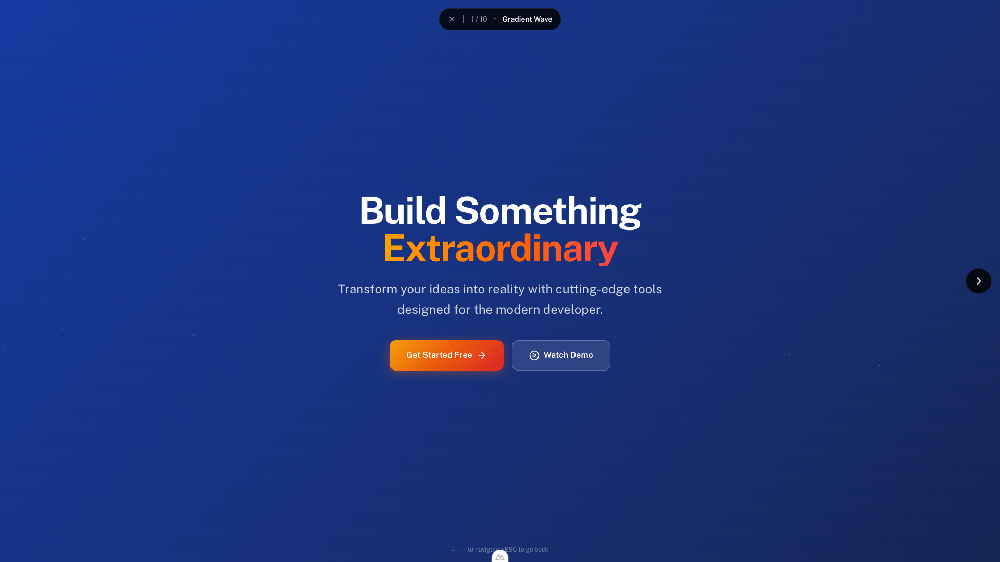
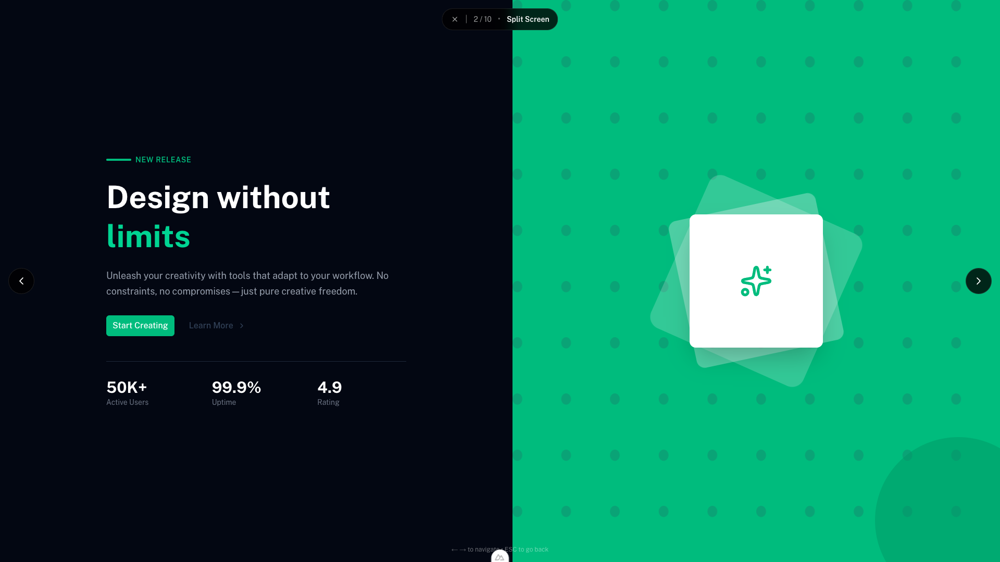
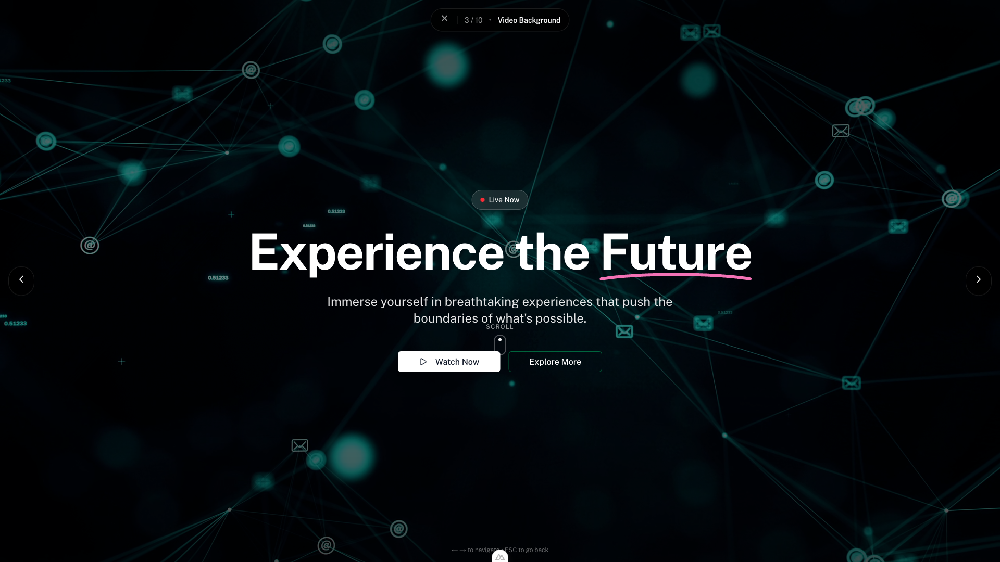
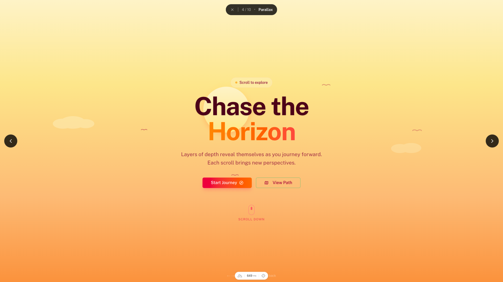
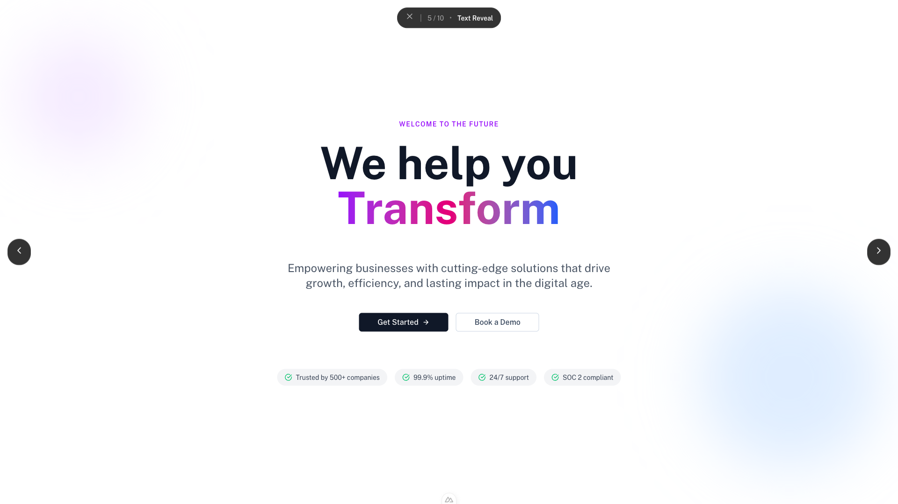
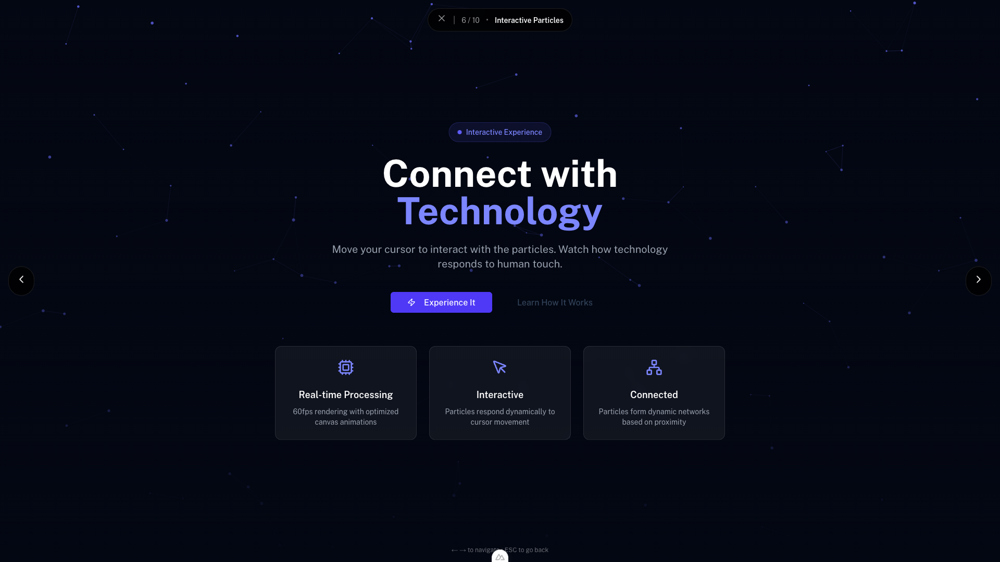
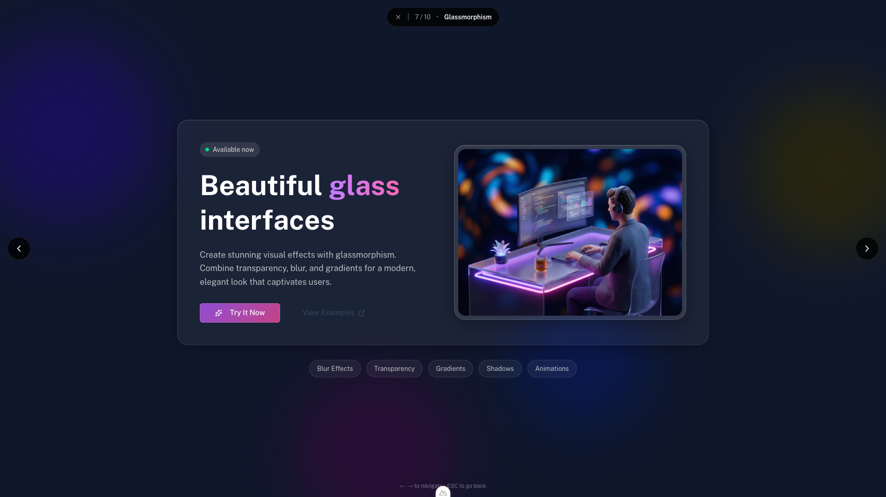
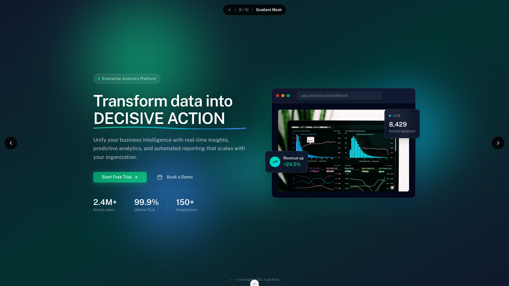
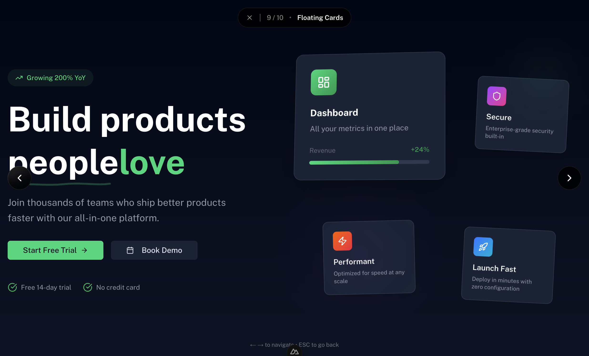
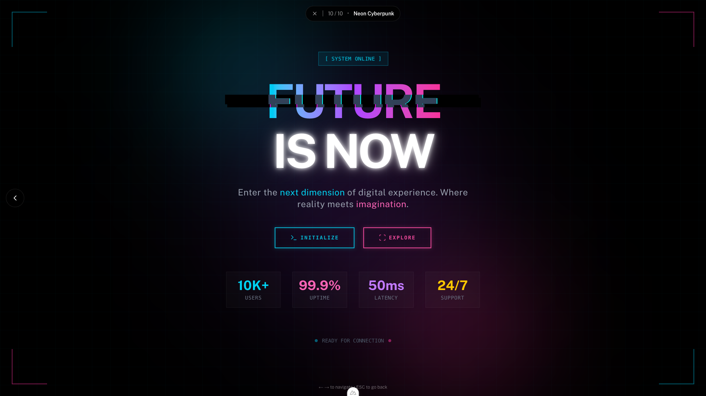

# 10 Vue Powered Heroes for Design Inspiration

Hero sections are the crown jewels of web design—the first impression that can make or break user engagement. A well-crafted hero captures attention, communicates value, and guides users deeper into your site. In this article, let's explore 10 diverse hero section designs built with Vue.js and Nuxt UI, ranging from elegant simplicity to immersive interactive experiences.

Each design showcases different techniques, from CSS animations to Canvas-based particle systems. Whether you're building a SaaS landing page, a portfolio site, or an e-commerce platform, you'll find inspiration (and production-ready code) to elevate your next project.

NOTE: All these designs were created with the help of:

- [Claude Code](https://code.claude.com/docs/en/overview)
- [Cursor](https://www.cursor.com/)
- [The Ralph Wiggum Claude Code Plugin](https://awesomeclaude.ai/ralph-wiggum)

The initial version of all these designs started with this prompt in Claude Code with Opus selected as the model:

```
/ralph-wiggum:ralph-loop "read the prd.md file and follow instructions" --completion-promise "DONE" --max-iterations 25
```
And this was the prd.md file:
```markdown
// prd.md

Goal: Create 10 Different Hero Section Designs as inspiration for Vue developers to use in their own projects.

## Hero Requirements:

- Each hero section design should be a separate component
- Each hero section design should be responsive
- Each hero section should have a unique design
- Vary the difficulty level of the designs but do NOT include extremely simple designs
- Be creative but practical
- Use browser to check and iterate on the design
```

After a pretty decent initial version, I iterated for about an hour and a half over each hero to get the final results.

---

## 1. Animated Gradient Wave



### What Makes It Effective

The Animated Gradient Wave hero creates a sense of movement and energy through its continuously shifting background colors. This design works exceptionally well for tech startups, creative agencies, and any brand wanting to convey innovation and dynamism.

**Key design elements:**

- **Shifting gradient background** that cycles through deep purples, cyans, and pinks
- **Floating particles** that add depth and visual interest
- **Semi-transparent overlay** ensuring text remains readable
- **Gradient text accent** on the headline for visual pop

### Implementation Details

The magic happens through CSS animations applied to a large gradient background. By using `background-size: 400%` and animating the `background-position`, we create the illusion of flowing colors without any JavaScript overhead.

The floating particles are generated using Vue's `v-for` directive, with randomized positions and animation delays to create organic movement.

```html
<script setup lang="ts">
  // Hero 1: Animated Gradient Wave
  // Features a dynamic gradient background with smooth wave animations
  // The gradient shifts between colors creating a mesmerizing effect
</script>

<template>
  <section
    class="relative min-h-screen overflow-hidden bg-gray-900 flex items-center justify-center"
  >
    <!-- Animated gradient background -->
    <div class="absolute inset-0 gradient-wave" />

    <!-- Overlay for better text readability -->
    <div class="absolute inset-0 bg-black/30" />

    <!-- Content -->
    <div class="relative z-10 text-center px-4 max-w-4xl mx-auto">
      <span
        class="inline-block px-4 py-2 mb-6 text-sm font-medium text-white/90 bg-white/10 backdrop-blur-sm rounded-full border border-white/20"
      >
        Introducing the Future
      </span>

      <h1 class="text-5xl md:text-7xl font-bold text-white mb-6 tracking-tight">
        Build Something
        <span
          class="block bg-gradient-to-r from-cyan-400 via-purple-500 to-pink-500 bg-clip-text text-transparent"
        >
          Extraordinary
        </span>
      </h1>

      <p
        class="text-xl md:text-2xl text-white/80 mb-10 max-w-2xl mx-auto leading-relaxed"
      >
        Transform your ideas into reality with cutting-edge tools designed for
        the modern developer.
      </p>

      <div class="flex flex-col sm:flex-row gap-4 justify-center">
        <UButton size="xl" color="white" class="px-8">
          Get Started Free
          <template #trailing>
            <UIcon name="i-lucide-arrow-right" />
          </template>
        </UButton>

        <UButton size="xl" variant="outline" color="white" class="px-8">
          <UIcon name="i-lucide-play-circle" class="mr-2" />
          Watch Demo
        </UButton>
      </div>
    </div>

    <!-- Floating particles for depth -->
    <div class="absolute inset-0 overflow-hidden pointer-events-none">
      <div
        v-for="i in 20"
        :key="i"
        class="particle"
        :style="{
          left: `${Math.random() * 100}%`,
          animationDelay: `${Math.random() * 5}s`,
          animationDuration: `${15 + Math.random() * 10}s`,
        }"
      />
    </div>
  </section>
</template>

<style scoped>
  /* Animated gradient background using CSS */
  .gradient-wave {
    background: linear-gradient(
      -45deg,
      #0f172a,
      #1e1a78,
      #5b21b6,
      #7c3aed,
      #06b6d4,
      #0f172a
    );
    background-size: 400% 400%;
    animation: gradient-shift 15s ease infinite;
  }

  @keyframes gradient-shift {
    0% {
      background-position: 0% 50%;
    }
    50% {
      background-position: 100% 50%;
    }
    100% {
      background-position: 0% 50%;
    }
  }

  /* Floating particles */
  .particle {
    position: absolute;
    width: 4px;
    height: 4px;
    background: white;
    border-radius: 50%;
    opacity: 0.3;
    animation: float-up linear infinite;
  }

  @keyframes float-up {
    0% {
      transform: translateY(100vh) scale(0);
      opacity: 0;
    }
    10% {
      opacity: 0.3;
    }
    90% {
      opacity: 0.3;
    }
    100% {
      transform: translateY(-10vh) scale(1);
      opacity: 0;
    }
  }
</style>
```

---

## 2. Split Screen Design



### What Makes It Effective

The Split Screen design creates visual balance by dividing the viewport into two distinct zones: content on one side, visuals on the other. This layout is particularly effective for product showcases, app launches, and any scenario where you want to present information alongside compelling imagery.

**Key design elements:**

- **High contrast color scheme** with dark content area and vibrant accent color
- **Floating geometric shapes** that add playfulness and depth
- **Stats section** that builds credibility with social proof
- **Clear visual hierarchy** guiding the eye from headline to CTA

### Implementation Details

The layout uses CSS Flexbox to create the split, with `flex-col lg:flex-row` for responsive behavior. The right panel features layered shapes with staggered float animations, creating a 3D illusion. Each shape has its own animation delay for organic movement.

```html
<script setup lang="ts">
  // Hero 2: Split Screen Design
  // A bold split-screen layout with contrasting colors
  // Image on one side, content on the other - great for product showcases
</script>

<template>
  <section class="min-h-screen flex flex-col lg:flex-row">
    <!-- Left side - Content -->
    <div
      class="flex-1 flex items-center justify-center bg-gray-950 px-6 py-16 lg:py-0"
    >
      <div class="max-w-xl">
        <div class="flex items-center gap-2 mb-6">
          <div class="h-1 w-12 bg-emerald-500 rounded-full" />
          <span
            class="text-emerald-500 font-semibold text-sm uppercase tracking-wider"
          >
            New Release
          </span>
        </div>

        <h1
          class="text-4xl md:text-5xl lg:text-6xl font-bold text-white mb-6 leading-tight"
        >
          Design without
          <span class="text-emerald-400">limits</span>
        </h1>

        <p class="text-lg text-gray-400 mb-8 leading-relaxed">
          Unleash your creativity with tools that adapt to your workflow. No
          constraints, no compromises—just pure creative freedom.
        </p>

        <div class="flex flex-col sm:flex-row gap-4">
          <UButton
            size="xl"
            color="primary"
            class="bg-emerald-500 hover:bg-emerald-600"
          >
            Start Creating
          </UButton>

          <UButton size="xl" variant="ghost" color="white">
            Learn More
            <template #trailing>
              <UIcon name="i-lucide-chevron-right" />
            </template>
          </UButton>
        </div>

        <!-- Stats for social proof -->
        <div class="mt-12 pt-8 border-t border-gray-800 grid grid-cols-3 gap-8">
          <div>
            <div class="text-3xl font-bold text-white">50K+</div>
            <div class="text-sm text-gray-500">Active Users</div>
          </div>
          <div>
            <div class="text-3xl font-bold text-white">99.9%</div>
            <div class="text-sm text-gray-500">Uptime</div>
          </div>
          <div>
            <div class="text-3xl font-bold text-white">4.9</div>
            <div class="text-sm text-gray-500">Rating</div>
          </div>
        </div>
      </div>
    </div>

    <!-- Right side - Visual -->
    <div
      class="flex-1 relative bg-emerald-500 min-h-[50vh] lg:min-h-screen overflow-hidden"
    >
      <!-- Decorative pattern -->
      <div class="absolute inset-0 opacity-20">
        <svg
          class="w-full h-full"
          viewBox="0 0 100 100"
          preserveAspectRatio="none"
        >
          <pattern
            id="grid"
            width="10"
            height="10"
            patternUnits="userSpaceOnUse"
          >
            <circle cx="1" cy="1" r="1" fill="currentColor" />
          </pattern>
          <rect width="100" height="100" fill="url(#grid)" />
        </svg>
      </div>

      <!-- Floating shapes with animation -->
      <div class="absolute inset-0 flex items-center justify-center">
        <div class="relative w-80 h-80">
          <div
            class="absolute inset-0 bg-white/20 rounded-3xl transform rotate-12 animate-float"
          />
          <div
            class="absolute inset-4 bg-white/30 rounded-2xl transform -rotate-6 animate-float-delayed"
          />
          <div
            class="absolute inset-8 bg-white rounded-xl shadow-2xl flex items-center justify-center"
          >
            <UIcon
              name="i-lucide-sparkles"
              class="w-16 h-16 text-emerald-500"
            />
          </div>
        </div>
      </div>

      <!-- Corner accent -->
      <div
        class="absolute -bottom-20 -right-20 w-80 h-80 bg-emerald-600 rounded-full opacity-50"
      />
    </div>
  </section>
</template>

<style scoped>
  @keyframes float {
    0%,
    100% {
      transform: translateY(0) rotate(12deg);
    }
    50% {
      transform: translateY(-20px) rotate(12deg);
    }
  }

  @keyframes float-delayed {
    0%,
    100% {
      transform: translateY(0) rotate(-6deg);
    }
    50% {
      transform: translateY(-15px) rotate(-6deg);
    }
  }

  .animate-float {
    animation: float 6s ease-in-out infinite;
  }

  .animate-float-delayed {
    animation: float-delayed 6s ease-in-out infinite;
    animation-delay: 0.5s;
  }
</style>
```

---

## 3. Video Background



### What Makes It Effective

Nothing captures attention quite like motion. The Video Background hero creates an immersive experience that immediately draws users into your narrative. This design excels for entertainment brands, travel companies, and any product with a strong visual story to tell.

**Key design elements:**

- **Full-screen looping video** that plays automatically and silently
- **Gradient overlay** transitioning from dark top to bottom for text legibility
- **"Live Now" indicator** with animated ping effect creating urgency
- **Custom underline SVG** on the headline for typographic flair
- **Scroll indicator** encouraging users to explore more

### Implementation Details

The video element uses `autoplay`, `muted`, `loop`, and `playsinline` attributes for seamless background playback across devices. The gradient overlay uses a `via` stop for a smooth transition, and the scroll indicator features a custom bounce animation.

```html
<script setup lang="ts">
  // Hero 3: Video Background
  // Full-screen video background with overlay and centered content
  // Uses a placeholder video - replace with actual video in production

  const videoUrl =
    "https://videos.pexels.com/video-files/3129671/3129671-uhd_2560_1440_30fps.mp4";
</script>

<template>
  <section
    class="relative min-h-screen overflow-hidden flex items-center justify-center"
  >
    <!-- Video Background -->
    <video
      autoplay
      muted
      loop
      playsinline
      class="absolute inset-0 w-full h-full object-cover"
    >
      <source :src="videoUrl" type="video/mp4" />
    </video>

    <!-- Dark overlay with gradient -->
    <div
      class="absolute inset-0 bg-gradient-to-b from-black/70 via-black/50 to-black/70"
    />

    <!-- Content -->
    <div class="relative z-10 text-center px-4 max-w-5xl mx-auto">
      <!-- Live indicator with ping animation -->
      <div
        class="inline-flex items-center gap-2 px-4 py-2 mb-8 bg-white/10 backdrop-blur-md rounded-full border border-white/20"
      >
        <span class="relative flex h-2 w-2">
          <span
            class="animate-ping absolute inline-flex h-full w-full rounded-full bg-red-400 opacity-75"
          />
          <span class="relative inline-flex rounded-full h-2 w-2 bg-red-500" />
        </span>
        <span class="text-white text-sm font-medium">Live Now</span>
      </div>

      <h1
        class="text-5xl md:text-7xl lg:text-8xl font-bold text-white mb-8 tracking-tight"
      >
        Experience the
        <span class="relative inline-block">
          Future
          <!-- Custom SVG underline -->
          <svg
            class="absolute -bottom-2 left-0 w-full"
            viewBox="0 0 200 12"
            fill="none"
          >
            <path
              d="M2 10C50 2 150 2 198 10"
              stroke="url(#gradient)"
              stroke-width="4"
              stroke-linecap="round"
            />
            <defs>
              <linearGradient id="gradient" x1="0" y1="0" x2="200" y2="0">
                <stop offset="0%" stop-color="#f472b6" />
                <stop offset="100%" stop-color="#c084fc" />
              </linearGradient>
            </defs>
          </svg>
        </span>
      </h1>

      <p
        class="text-xl md:text-2xl text-white/90 mb-12 max-w-3xl mx-auto font-light"
      >
        Immerse yourself in breathtaking experiences that push the boundaries of
        what's possible.
      </p>

      <div class="flex flex-col sm:flex-row gap-4 justify-center">
        <UButton
          size="xl"
          class="bg-white text-gray-900 hover:bg-gray-100 px-10"
        >
          <UIcon name="i-lucide-play" class="mr-2" />
          Watch Now
        </UButton>

        <UButton
          size="xl"
          variant="outline"
          class="border-white/50 text-white hover:bg-white/10 px-10"
        >
          Explore More
        </UButton>
      </div>

      <!-- Scroll indicator -->
      <div class="absolute bottom-8 left-1/2 -translate-x-1/2">
        <div class="flex flex-col items-center gap-2 text-white/60">
          <span class="text-xs uppercase tracking-widest">Scroll</span>
          <div class="w-6 h-10 border-2 border-white/30 rounded-full p-1">
            <div
              class="w-1.5 h-1.5 bg-white rounded-full animate-scroll-indicator mx-auto"
            />
          </div>
        </div>
      </div>
    </div>
  </section>
</template>

<style scoped>
  @keyframes scroll-indicator {
    0%,
    100% {
      transform: translateY(0);
      opacity: 1;
    }
    50% {
      transform: translateY(16px);
      opacity: 0.3;
    }
  }

  .animate-scroll-indicator {
    animation: scroll-indicator 2s ease-in-out infinite;
  }
</style>
```

---

## 4. Layered Paper-Cut Parallax



### What Makes It Effective

This parallax hero creates a warm, artistic atmosphere using a layered paper-cut aesthetic reminiscent of shadow box art. The sunset gradient and silhouetted landscape layers evoke feelings of adventure and discovery—perfect for travel brands, outdoor companies, lifestyle products, or any experience-driven narrative.

**Key design elements:**

- **Warm sunset gradient** transitioning from golden amber to deep rose
- **Organic silhouette layers** including hills, trees, and grass at different depths
- **Glowing sun orb** with subtle blur creating a dreamy focal point
- **Animated birds** at varying parallax speeds adding life to the scene
- **Sticky content** that remains centered while the landscape scrolls past

### Implementation Details

The parallax effect uses Vue's reactivity to track `scrollY` and applies different transform multipliers to each layer—slower for distant elements (0.05x–0.2x) and faster for foreground elements (0.5x–0.7x). SVG paths create the organic hill and tree silhouettes, while CSS gradients paint the warm sky. The birds have independent float animations combined with scroll-based transforms for dynamic movement.

```html
<script setup lang="ts">
  // Hero 4: Layered Paper-Cut Parallax
  // A warm, artistic parallax effect with silhouetted layers
  // Creates depth through overlapping organic shapes at different scroll speeds

  import { ref, onMounted, onUnmounted } from "vue";

  const scrollY = ref(0);

  const handleScroll = () => {
    scrollY.value = window.scrollY;
  };

  onMounted(() => {
    window.addEventListener("scroll", handleScroll, { passive: true });
  });

  onUnmounted(() => {
    window.removeEventListener("scroll", handleScroll);
  });
</script>

<template>
  <section class="relative min-h-[200vh] overflow-hidden">
    <!-- Sky gradient - slowest layer (0.05x scroll speed) -->
    <div
      class="absolute inset-0 sky-gradient"
      :style="{ transform: `translateY(${scrollY * 0.05}px)` }"
    />

    <!-- Sun orb with glow (0.15x scroll speed) -->
    <div
      class="absolute left-1/2 -translate-x-1/2 top-[15%] w-32 h-32 md:w-48 md:h-48"
      :style="{ transform: `translateX(-50%) translateY(${scrollY * 0.15}px)` }"
    >
      <div
        class="w-full h-full rounded-full bg-gradient-to-b from-amber-200 to-orange-300 blur-sm"
      />
      <div
        class="absolute inset-2 rounded-full bg-gradient-to-b from-amber-100 to-amber-200"
      />
    </div>

    <!-- Distant hills - Layer 1 (0.2x scroll speed) -->
    <div
      class="absolute bottom-0 left-0 right-0"
      :style="{ transform: `translateY(${scrollY * 0.2}px)` }"
    >
      <svg
        class="w-full h-auto"
        viewBox="0 0 1440 400"
        preserveAspectRatio="none"
        fill="none"
      >
        <path
          d="M0 400V280C120 250 240 300 400 260C560 220 680 280 840 240C1000 200 1160 260 1280 230C1360 210 1400 240 1440 220V400H0Z"
          class="fill-rose-300/60"
        />
      </svg>
    </div>

    <!-- Mid hills - Layer 2 (0.35x scroll speed) -->
    <div
      class="absolute bottom-0 left-0 right-0"
      :style="{ transform: `translateY(${scrollY * 0.35}px)` }"
    >
      <svg
        class="w-full h-auto"
        viewBox="0 0 1440 350"
        preserveAspectRatio="none"
        fill="none"
      >
        <path
          d="M0 350V200C100 240 200 180 350 210C500 240 600 160 750 200C900 240 1050 170 1200 210C1300 235 1380 200 1440 220V350H0Z"
          class="fill-rose-400/70"
        />
      </svg>
    </div>

    <!-- Trees layer - Layer 3 (0.5x scroll speed) -->
    <div
      class="absolute bottom-0 left-0 right-0"
      :style="{ transform: `translateY(${scrollY * 0.5}px)` }"
    >
      <svg
        class="w-full h-auto"
        viewBox="0 0 1440 300"
        preserveAspectRatio="none"
        fill="none"
      >
        <!-- Base hill -->
        <path
          d="M0 300V180C150 200 300 150 450 170C600 190 750 140 900 165C1050 190 1200 145 1350 170C1400 178 1420 175 1440 180V300H0Z"
          class="fill-rose-700/80"
        />
        <!-- Tree silhouettes -->
        <path d="M80 180L100 120L120 180Z" class="fill-rose-800" />
        <path d="M200 170L230 90L260 170Z" class="fill-rose-800" />
        <path d="M500 175L525 95L550 175Z" class="fill-rose-800" />
        <path d="M700 160L730 70L760 160Z" class="fill-rose-800" />
        <path d="M1050 165L1080 80L1110 165Z" class="fill-rose-800" />
        <path d="M1250 175L1270 115L1290 175Z" class="fill-rose-800" />
      </svg>
    </div>

    <!-- Foreground layer - closest (0.7x scroll speed) -->
    <div
      class="absolute bottom-0 left-0 right-0"
      :style="{ transform: `translateY(${scrollY * 0.7}px)` }"
    >
      <svg
        class="w-full h-auto"
        viewBox="0 0 1440 200"
        preserveAspectRatio="none"
        fill="none"
      >
        <path
          d="M0 200V120C80 100 160 130 280 110C400 90 520 120 640 100C760 80 880 115 1000 95C1120 75 1240 110 1360 90C1400 85 1420 95 1440 90V200H0Z"
          class="fill-rose-950"
        />
      </svg>
    </div>

    <!-- Flying birds at different parallax speeds -->
    <div
      v-for="i in 5"
      :key="`bird-${i}`"
      class="absolute bird"
      :style="{
        left: `${10 + i * 18}%`,
        top: `${15 + (i % 3) * 8}%`,
        transform: `translateY(${scrollY * (0.1 + i * 0.05)}px)`,
        opacity: 0.6 - i * 0.08,
      }"
    >
      <svg width="24" height="12" viewBox="0 0 24 12" fill="none">
        <path
          d="M0 6C4 2 8 4 12 6C16 4 20 2 24 6"
          stroke="currentColor"
          stroke-width="2"
          stroke-linecap="round"
          class="text-rose-800"
        />
      </svg>
    </div>

    <!-- Sticky content -->
    <div
      class="sticky top-0 min-h-screen flex items-center justify-center px-4 pt-16"
    >
      <div class="text-center max-w-3xl relative z-10">
        <h1 class="text-5xl md:text-7xl lg:text-8xl font-bold mb-6">
          <span class="block text-rose-950">Chase the</span>
          <span
            class="block text-transparent bg-clip-text bg-gradient-to-r from-amber-500 via-orange-500 to-rose-500"
          >
            Horizon
          </span>
        </h1>

        <p class="text-lg md:text-xl text-rose-900/80 mb-10 max-w-xl mx-auto">
          Layers of depth reveal themselves as you journey forward. Each scroll
          brings new perspectives.
        </p>

        <div class="flex flex-col sm:flex-row gap-4 justify-center">
          <UButton
            size="xl"
            class="bg-gradient-to-r from-rose-600 to-orange-500 text-white px-8"
          >
            Start Journey
            <template #trailing>
              <UIcon name="i-lucide-compass" />
            </template>
          </UButton>

          <UButton
            size="xl"
            variant="outline"
            class="border-rose-400/50 text-rose-800 px-8"
          >
            <UIcon name="i-lucide-map" class="mr-2" />
            View Path
          </UButton>
        </div>
      </div>
    </div>
  </section>
</template>

<style scoped>
  .sky-gradient {
    background: linear-gradient(
      180deg,
      #fef3c7 0%,
      #fde68a 15%,
      #fdba74 35%,
      #fb923c 50%,
      #f97316 65%,
      #ea580c 80%,
      #c2410c 100%
    );
  }

  .bird {
    animation: bird-float 4s ease-in-out infinite;
  }

  @keyframes bird-float {
    0%,
    100% {
      transform: translateY(0);
    }
    50% {
      transform: translateY(-8px);
    }
  }
</style>
```

---

## 5. Typewriter Text Reveal



### What Makes It Effective

The Typewriter Text Reveal hero focuses on typography as the star of the show. The classic typewriter effect—characters appearing one by one with a blinking cursor—creates anticipation and draws the eye to your key messaging. It's ideal for agencies, consultancies, and any brand where messaging takes center stage.

**Key design elements:**

- **Typewriter animation** that types out words character by character
- **Blinking cursor** with gradient styling that adds polish
- **Delete and retype cycle** smoothly transitioning between value propositions
- **Gradient text effect** on the cycling words creating vibrant visual emphasis
- **Staggered reveal animations** for surrounding content
- **Decorative blur orbs** adding depth without distraction
- **Trust badges** appearing with final animation wave
- **Clean, minimal aesthetic** that lets typography shine

### Implementation Details

The typewriter effect uses Vue's reactivity to build up `displayedText` character by character. After each word is fully typed, the animation pauses, then deletes characters in reverse before moving to the next word. A separate interval controls the cursor blink. The staggered reveal uses CSS transitions with incremental `transition-delay` values.

```html
<script setup lang="ts">
  // Hero 5: Animated Text Reveal with Typewriter Effect
  // Sophisticated text animations with typewriter reveal
  // Uses character-by-character typing with blinking cursor

  import { ref, onMounted, onUnmounted, computed } from "vue";

  const isLoaded = ref(false);
  const words = ["Innovate", "Create", "Transform"];
  const currentWordIndex = ref(0);
  const displayedText = ref("");
  const isTyping = ref(true);
  const showCursor = ref(true);

  // Typing configuration
  const TYPING_SPEED = 100; // ms per character
  const DELETING_SPEED = 60; // ms per character (faster deletion)
  const PAUSE_AFTER_WORD = 2000; // ms to pause after typing word
  const PAUSE_BEFORE_TYPE = 500; // ms to pause before typing new word

  let typingTimeout = null;
  let cursorInterval = null;

  const currentWord = computed(() => words[currentWordIndex.value]);

  function typeNextCharacter() {
    const word = currentWord.value;
    if (displayedText.value.length < word.length) {
      displayedText.value = word.slice(0, displayedText.value.length + 1);
      typingTimeout = setTimeout(typeNextCharacter, TYPING_SPEED);
    } else {
      // Word complete, pause then start deleting
      isTyping.value = false;
      typingTimeout = setTimeout(deleteCharacter, PAUSE_AFTER_WORD);
    }
  }

  function deleteCharacter() {
    if (displayedText.value.length > 0) {
      displayedText.value = displayedText.value.slice(0, -1);
      typingTimeout = setTimeout(deleteCharacter, DELETING_SPEED);
    } else {
      // Deletion complete, move to next word
      currentWordIndex.value = (currentWordIndex.value + 1) % words.length;
      isTyping.value = true;
      typingTimeout = setTimeout(typeNextCharacter, PAUSE_BEFORE_TYPE);
    }
  }

  function startTypewriter() {
    typingTimeout = setTimeout(typeNextCharacter, PAUSE_BEFORE_TYPE);
  }

  onMounted(() => {
    isLoaded.value = true;

    // Start cursor blink
    cursorInterval = setInterval(() => {
      showCursor.value = !showCursor.value;
    }, 530);

    // Start typewriter after initial animations
    setTimeout(startTypewriter, 800);
  });

  onUnmounted(() => {
    if (typingTimeout) clearTimeout(typingTimeout);
    if (cursorInterval) clearInterval(cursorInterval);
  });
</script>

<template>
  <section
    class="min-h-screen bg-white dark:bg-gray-950 flex items-center justify-center px-4 overflow-hidden"
  >
    <div class="max-w-6xl mx-auto text-center">
      <!-- Decorative blur elements -->
      <div
        class="absolute top-20 left-10 w-64 h-64 bg-purple-200 dark:bg-purple-900/30 rounded-full blur-3xl opacity-50"
      />
      <div
        class="absolute bottom-20 right-10 w-96 h-96 bg-blue-200 dark:bg-blue-900/30 rounded-full blur-3xl opacity-50"
      />

      <!-- Tag line with reveal animation -->
      <div
        class="overflow-hidden mb-6"
        :class="isLoaded ? 'opacity-100' : 'opacity-0'"
      >
        <span
          class="inline-block text-sm font-semibold tracking-widest uppercase text-purple-600 dark:text-purple-400 transition-transform duration-700"
          :class="isLoaded ? 'translate-y-0' : 'translate-y-full'"
        >
          Welcome to the future
        </span>
      </div>

      <!-- Main heading with typewriter effect -->
      <h1 class="text-5xl md:text-7xl lg:text-8xl font-bold mb-8 relative">
        <span
          class="block text-gray-900 dark:text-white transition-all duration-700 delay-100"
          :class="
            isLoaded ? 'opacity-100 translate-y-0' : 'opacity-0 translate-y-8'
          "
        >
          We help you
        </span>

        <!-- Typewriter word with cursor -->
        <span
          class="relative inline-block min-w-[3ch] transition-all duration-700 delay-200"
          :class="
            isLoaded ? 'opacity-100 translate-y-0' : 'opacity-0 translate-y-8'
          "
        >
          <span
            class="bg-gradient-to-r from-purple-600 via-pink-600 to-blue-600 bg-clip-text text-transparent"
          >
            {{ displayedText }}
          </span>
          <!-- Blinking cursor -->
          <span
            class="inline-block w-[3px] md:w-[4px] h-[0.85em] ml-1 align-middle bg-gradient-to-b from-purple-600 to-pink-600 rounded-sm transition-opacity duration-100"
            :class="showCursor ? 'opacity-100' : 'opacity-0'"
          />
        </span>
      </h1>

      <!-- Description with staggered reveal -->
      <p
        class="text-xl md:text-2xl text-gray-600 dark:text-gray-400 max-w-3xl mx-auto mb-12 transition-all duration-700 delay-300"
        :class="
          isLoaded ? 'opacity-100 translate-y-0' : 'opacity-0 translate-y-8'
        "
      >
        Empowering businesses with cutting-edge solutions that drive growth,
        efficiency, and lasting impact in the digital age.
      </p>

      <!-- CTA buttons with reveal -->
      <div
        class="flex flex-col sm:flex-row gap-4 justify-center transition-all duration-700 delay-500"
        :class="
          isLoaded ? 'opacity-100 translate-y-0' : 'opacity-0 translate-y-8'
        "
      >
        <UButton
          size="xl"
          class="bg-gray-900 dark:bg-white text-white dark:text-gray-900 hover:bg-gray-800 dark:hover:bg-gray-100 px-10"
        >
          Get Started
          <template #trailing>
            <UIcon name="i-lucide-arrow-right" />
          </template>
        </UButton>

        <UButton size="xl" variant="outline" color="neutral" class="px-10">
          Book a Demo
        </UButton>
      </div>

      <!-- Trust badges with staggered animation -->
      <div
        class="mt-20 flex flex-wrap justify-center gap-4 transition-all duration-700 delay-700"
        :class="
          isLoaded ? 'opacity-100 translate-y-0' : 'opacity-0 translate-y-8'
        "
      >
        <span
          v-for="(badge, i) in [
            'Trusted by 500+ companies',
            '99.9% uptime',
            '24/7 support',
            'SOC 2 compliant',
          ]"
          :key="badge"
          class="inline-flex items-center gap-2 px-4 py-2 bg-gray-100 dark:bg-gray-800 rounded-full text-sm text-gray-700 dark:text-gray-300"
          :style="{ transitionDelay: `${700 + i * 100}ms` }"
        >
          <UIcon name="i-lucide-check-circle" class="w-4 h-4 text-green-500" />
          {{ badge }}
        </span>
      </div>
    </div>
  </section>
</template>
```

---

## 6. Interactive Particles



### What Makes It Effective

The Interactive Particles hero transforms a static page into a living, breathing environment. Particles drift across the screen and react to cursor movement, creating a memorable and playful experience. This design is perfect for tech products, creative tools, and any brand wanting to showcase innovation.

**Key design elements:**

- **Canvas-based particle system** with smooth 60fps animations
- **Varied particle colors** from an indigo-to-cyan-to-violet spectrum for visual richness
- **Pulsing particle sizes** with individual animation offsets for organic movement
- **Smooth physics-based mouse interaction** using lerped cursor position and force falloff curves
- **Gradient glow effects** on each particle for depth and luminosity
- **Dynamic gradient connections** between nearby particles that blend their colors
- **Feature cards** highlighting the interactive nature of the experience

### Implementation Details

This hero uses the HTML5 Canvas API for performant particle rendering. Each particle has velocity, position, radius, color, opacity, and pulse properties. The animation loop uses linear interpolation (lerp) for smooth cursor tracking, applies physics-based repulsion with inverse-square falloff, and renders particles with radial gradients for a glow effect. Connection lines use linear gradients that blend the colors of connected particles. Velocity damping and friction create natural, fluid motion.

```html
<script setup lang="ts">
  // Hero 6: Interactive Particles
  // Canvas-based particle system with mouse interaction
  // Particles connect to nearby particles and respond to cursor movement
  // Features varied colors, sizes, and smooth physics-based cursor interaction

  import { ref, onMounted, onUnmounted } from "vue";

  interface Particle {
    x: number;
    y: number;
    vx: number;
    vy: number;
    radius: number;
    baseRadius: number;
    color: { r: number; g: number; b: number };
    opacity: number;
    pulseSpeed: number;
    pulseOffset: number;
  }

  // Color palette for particles - indigo to cyan to violet spectrum
  const colorPalette = [
    { r: 99, g: 102, b: 241 }, // indigo-500
    { r: 129, g: 140, b: 248 }, // indigo-400
    { r: 79, g: 70, b: 229 }, // indigo-600
    { r: 139, g: 92, b: 246 }, // violet-500
    { r: 6, g: 182, b: 212 }, // cyan-500
    { r: 34, g: 211, b: 238 }, // cyan-400
    { r: 167, g: 139, b: 250 }, // violet-400
  ];

  const canvasRef = ref<HTMLCanvasElement | null>(null);
  const mousePos = ref({ x: -1000, y: -1000 }); // Start off-screen
  const targetMousePos = ref({ x: -1000, y: -1000 });
  let particles: Particle[] = [];
  let animationId: number;
  let time = 0;

  const createParticles = (width: number, height: number) => {
    const count = Math.floor((width * height) / 12000);
    particles = Array.from({ length: Math.min(count, 120) }, () => {
      const baseRadius = Math.random() * 2.5 + 0.8;
      return {
        x: Math.random() * width,
        y: Math.random() * height,
        vx: (Math.random() - 0.5) * 0.4,
        vy: (Math.random() - 0.5) * 0.4,
        radius: baseRadius,
        baseRadius,
        color: colorPalette[Math.floor(Math.random() * colorPalette.length)],
        opacity: Math.random() * 0.4 + 0.4,
        pulseSpeed: Math.random() * 0.02 + 0.01,
        pulseOffset: Math.random() * Math.PI * 2,
      };
    });
  };

  const lerp = (start: number, end: number, factor: number) => {
    return start + (end - start) * factor;
  };

  // Main animation loop
  const animate = () => {
    const canvas = canvasRef.value;
    if (!canvas) return;

    const ctx = canvas.getContext("2d");
    if (!ctx) return;

    time += 0.016; // ~60fps time increment

    // Smooth mouse position interpolation for fluid cursor following
    mousePos.value.x = lerp(mousePos.value.x, targetMousePos.value.x, 0.08);
    mousePos.value.y = lerp(mousePos.value.y, targetMousePos.value.y, 0.08);

    ctx.clearRect(0, 0, canvas.width, canvas.height);

    particles.forEach((p, i) => {
      // Gentle pulsing effect on radius
      const pulse =
        Math.sin(time * p.pulseSpeed * 60 + p.pulseOffset) * 0.3 + 1;
      p.radius = p.baseRadius * pulse;

      // Move particle with slight damping
      p.x += p.vx;
      p.y += p.vy;

      // Soft edge bouncing with velocity dampening
      if (p.x < 0) {
        p.x = 0;
        p.vx *= -0.8;
      }
      if (p.x > canvas.width) {
        p.x = canvas.width;
        p.vx *= -0.8;
      }
      if (p.y < 0) {
        p.y = 0;
        p.vy *= -0.8;
      }
      if (p.y > canvas.height) {
        p.y = canvas.height;
        p.vy *= -0.8;
      }

      // Smooth mouse interaction with falloff curve
      const dx = mousePos.value.x - p.x;
      const dy = mousePos.value.y - p.y;
      const dist = Math.sqrt(dx * dx + dy * dy);
      const interactionRadius = 180;

      if (dist < interactionRadius && dist > 0) {
        // Smooth falloff using inverse square with dampening
        const force = Math.pow(1 - dist / interactionRadius, 2) * 0.8;
        const angle = Math.atan2(dy, dx);

        // Apply repulsion force gradually
        p.vx -= Math.cos(angle) * force * 0.5;
        p.vy -= Math.sin(angle) * force * 0.5;
      }

      // Apply subtle friction to prevent particles from flying too fast
      p.vx *= 0.98;
      p.vy *= 0.98;

      // Clamp velocity
      const maxSpeed = 3;
      const speed = Math.sqrt(p.vx * p.vx + p.vy * p.vy);
      if (speed > maxSpeed) {
        p.vx = (p.vx / speed) * maxSpeed;
        p.vy = (p.vy / speed) * maxSpeed;
      }

      // Draw particle with glow effect
      const gradient = ctx.createRadialGradient(
        p.x,
        p.y,
        0,
        p.x,
        p.y,
        p.radius * 2
      );
      gradient.addColorStop(
        0,
        `rgba(${p.color.r}, ${p.color.g}, ${p.color.b}, ${p.opacity})`
      );
      gradient.addColorStop(
        0.5,
        `rgba(${p.color.r}, ${p.color.g}, ${p.color.b}, ${p.opacity * 0.5})`
      );
      gradient.addColorStop(
        1,
        `rgba(${p.color.r}, ${p.color.g}, ${p.color.b}, 0)`
      );

      ctx.beginPath();
      ctx.arc(p.x, p.y, p.radius * 2, 0, Math.PI * 2);
      ctx.fillStyle = gradient;
      ctx.fill();

      // Core of particle
      ctx.beginPath();
      ctx.arc(p.x, p.y, p.radius, 0, Math.PI * 2);
      ctx.fillStyle = `rgba(${p.color.r}, ${p.color.g}, ${p.color.b}, ${p.opacity})`;
      ctx.fill();

      // Connect nearby particles with gradient lines
      particles.slice(i + 1).forEach((p2) => {
        const dx2 = p.x - p2.x;
        const dy2 = p.y - p2.y;
        const dist2 = Math.sqrt(dx2 * dx2 + dy2 * dy2);

        if (dist2 < 130) {
          const lineOpacity = (1 - dist2 / 130) * 0.25;

          // Create gradient line between particles
          const lineGradient = ctx.createLinearGradient(p.x, p.y, p2.x, p2.y);
          lineGradient.addColorStop(
            0,
            `rgba(${p.color.r}, ${p.color.g}, ${p.color.b}, ${lineOpacity})`
          );
          lineGradient.addColorStop(
            1,
            `rgba(${p2.color.r}, ${p2.color.g}, ${p2.color.b}, ${lineOpacity})`
          );

          ctx.beginPath();
          ctx.moveTo(p.x, p.y);
          ctx.lineTo(p2.x, p2.y);
          ctx.strokeStyle = lineGradient;
          ctx.lineWidth = 0.5 + (1 - dist2 / 130) * 0.5;
          ctx.stroke();
        }
      });
    });

    animationId = requestAnimationFrame(animate);
  };

  const handleResize = () => {
    const canvas = canvasRef.value;
    if (!canvas) return;

    canvas.width = window.innerWidth;
    canvas.height = window.innerHeight;
    createParticles(canvas.width, canvas.height);
  };

  const handleMouseMove = (e: MouseEvent) => {
    targetMousePos.value = { x: e.clientX, y: e.clientY };
  };

  const handleMouseLeave = () => {
    targetMousePos.value = { x: -1000, y: -1000 };
  };

  onMounted(() => {
    handleResize();
    animate();
    window.addEventListener("resize", handleResize);
    window.addEventListener("mousemove", handleMouseMove);
    window.addEventListener("mouseleave", handleMouseLeave);
  });

  onUnmounted(() => {
    cancelAnimationFrame(animationId);
    window.removeEventListener("resize", handleResize);
    window.removeEventListener("mousemove", handleMouseMove);
    window.removeEventListener("mouseleave", handleMouseLeave);
  });
</script>

<template>
  <section
    class="relative min-h-screen bg-gray-950 flex items-center justify-center overflow-hidden"
  >
    <!-- Canvas for particles -->
    <canvas ref="canvasRef" class="absolute inset-0" />

    <!-- Gradient overlay -->
    <div
      class="absolute inset-0 bg-gradient-to-b from-transparent via-gray-950/50 to-gray-950"
    />

    <!-- Content -->
    <div class="relative z-10 text-center px-4 max-w-4xl">
      <div
        class="inline-flex items-center gap-2 mb-6 px-4 py-2 bg-indigo-500/10 border border-indigo-500/20 rounded-full"
      >
        <div class="w-2 h-2 bg-indigo-500 rounded-full animate-pulse" />
        <span class="text-indigo-400 text-sm font-medium"
          >Interactive Experience</span
        >
      </div>

      <h1 class="text-5xl md:text-7xl font-bold text-white mb-6">
        Connect with
        <span class="text-indigo-400">Technology</span>
      </h1>

      <p class="text-xl text-gray-400 mb-10 max-w-2xl mx-auto">
        Move your cursor to interact with the particles. Watch how technology
        responds to human touch.
      </p>

      <div class="flex flex-col sm:flex-row gap-4 justify-center">
        <UButton size="xl" class="bg-indigo-600 hover:bg-indigo-700 px-8">
          <UIcon name="i-lucide-zap" class="mr-2" />
          Experience It
        </UButton>

        <UButton size="xl" variant="ghost" color="white" class="px-8">
          Learn How It Works
        </UButton>
      </div>

      <!-- Feature highlights -->
      <div class="mt-16 grid grid-cols-1 md:grid-cols-3 gap-6">
        <div
          class="p-6 bg-white/5 backdrop-blur-sm rounded-xl border border-white/10"
        >
          <UIcon name="i-lucide-cpu" class="w-8 h-8 text-indigo-400 mb-4" />
          <h3 class="text-lg font-semibold text-white mb-2">
            Real-time Processing
          </h3>
          <p class="text-sm text-gray-400">
            60fps rendering with optimized canvas animations
          </p>
        </div>

        <div
          class="p-6 bg-white/5 backdrop-blur-sm rounded-xl border border-white/10"
        >
          <UIcon
            name="i-lucide-mouse-pointer"
            class="w-8 h-8 text-indigo-400 mb-4"
          />
          <h3 class="text-lg font-semibold text-white mb-2">Interactive</h3>
          <p class="text-sm text-gray-400">
            Particles respond dynamically to cursor movement
          </p>
        </div>

        <div
          class="p-6 bg-white/5 backdrop-blur-sm rounded-xl border border-white/10"
        >
          <UIcon name="i-lucide-network" class="w-8 h-8 text-indigo-400 mb-4" />
          <h3 class="text-lg font-semibold text-white mb-2">Connected</h3>
          <p class="text-sm text-gray-400">
            Particles form dynamic networks based on proximity
          </p>
        </div>
      </div>
    </div>
  </section>
</template>
```

---

## 7. Glassmorphism Design



### What Makes It Effective

Glassmorphism brings a sense of depth and sophistication through translucent surfaces with blur effects. This design trend creates a layered, premium feel that works beautifully for fintech apps, dashboards, and modern SaaS products. The floating "glass" cards behind colorful blobs create a dynamic, eye-catching composition.

**Key design elements:**

- **Animated background blobs** providing colorful, organic movement
- **Frosted glass cards** with `backdrop-filter: blur()` and subtle borders
- **Layered card composition** creating depth and visual hierarchy
- **Interactive hover states** on floating cards
- **Feature tags** with glass effect for consistency

### Implementation Details

The glass effect is achieved through CSS `backdrop-filter: blur()` combined with semi-transparent backgrounds and subtle borders. The animated blobs use keyframe animations with translation and scaling. Multiple cards with rotation transforms and hover effects create the illusion of a 3D card stack.

```html
<script setup lang="ts">
  // Hero 7: Glassmorphism Design
  // Modern glass-effect UI with blur, transparency, and depth
  // Features layered glass cards with subtle shadows and borders
</script>

<template>
  <section class="relative min-h-screen overflow-hidden">
    <!-- Colorful background blobs -->
    <div class="absolute inset-0 bg-slate-900">
      <div
        class="absolute top-20 -left-20 w-96 h-96 bg-purple-500 rounded-full mix-blend-soft-light filter blur-3xl opacity-75 animate-blob"
      />
      <div
        class="absolute top-40 -right-20 w-96 h-96 bg-yellow-500 rounded-full mix-blend-soft-light filter blur-3xl opacity-75 animate-blob animation-delay-2000"
      />
      <div
        class="absolute -bottom-20 left-1/3 w-96 h-96 bg-pink-500 rounded-full mix-blend-soft-light filter blur-3xl opacity-75 animate-blob animation-delay-4000"
      />
      <div
        class="absolute bottom-40 right-1/4 w-80 h-80 bg-blue-500 rounded-full mix-blend-soft-light filter blur-3xl opacity-55 animate-blob animation-delay-3000"
      />
    </div>

    <!-- Content -->
    <div
      class="relative z-10 min-h-screen flex items-center justify-center px-4 py-20"
    >
      <div class="max-w-6xl mx-auto">
        <!-- Main glass card -->
        <div class="glass-card p-8 md:p-12 rounded-3xl">
          <div class="grid md:grid-cols-2 gap-12 items-center">
            <!-- Left content -->
            <div>
              <div
                class="inline-flex items-center gap-2 px-3 py-1.5 mb-6 bg-white/10 rounded-full"
              >
                <span class="w-2 h-2 bg-green-400 rounded-full" />
                <span class="text-white/80 text-sm">Available now</span>
              </div>

              <h1
                class="text-4xl md:text-5xl lg:text-6xl font-bold text-white mb-6 leading-tight"
              >
                Beautiful
                <span
                  class="text-transparent bg-clip-text bg-gradient-to-r from-purple-400 to-pink-400"
                >
                  glass
                </span>
                interfaces
              </h1>

              <p class="text-lg text-white/70 mb-8 leading-relaxed">
                Create stunning visual effects with glassmorphism. Combine
                transparency, blur, and gradients for a modern, elegant look
                that captivates users.
              </p>

              <div class="flex flex-col sm:flex-row gap-4">
                <UButton size="xl" class="glass-button px-8">
                  <UIcon name="i-lucide-sparkles" class="mr-2" />
                  Try It Now
                </UButton>

                <UButton size="xl" variant="link" color="white" class="px-8">
                  View Examples
                  <template #trailing>
                    <UIcon name="i-lucide-external-link" />
                  </template>
                </UButton>
              </div>
            </div>

            <!-- Right - Glass cards stack -->
            <div class="relative h-80 md:h-96">
              <!-- Floating glass cards with hover effects -->
              <div
                class="absolute top-0 right-0 w-64 glass-card-small p-6 rounded-2xl transform rotate-6 hover:rotate-0 transition-transform duration-300"
              >
                <div class="flex items-center gap-3 mb-4">
                  <div
                    class="w-10 h-10 bg-gradient-to-br from-purple-400 to-pink-400 rounded-xl flex items-center justify-center"
                  >
                    <UIcon name="i-lucide-layers" class="w-5 h-5 text-white" />
                  </div>
                  <div>
                    <div class="text-white font-medium">Layered Design</div>
                    <div class="text-white/50 text-sm">Multi-depth effects</div>
                  </div>
                </div>
                <div class="h-2 bg-white/10 rounded-full overflow-hidden">
                  <div
                    class="h-full w-3/4 bg-gradient-to-r from-purple-400 to-pink-400 rounded-full"
                  />
                </div>
              </div>

              <div
                class="absolute top-1/4 left-0 w-56 glass-card-small p-5 rounded-2xl transform -rotate-3 hover:rotate-0 transition-transform duration-300"
              >
                <div class="flex items-center justify-between mb-3">
                  <span class="text-white/70 text-sm">Performance</span>
                  <span class="text-green-400 text-sm font-medium">+24%</span>
                </div>
                <div class="text-3xl font-bold text-white mb-1">98.5%</div>
                <div class="text-white/50 text-sm">User satisfaction</div>
              </div>

              <div
                class="absolute bottom-0 right-8 w-48 glass-card-small p-4 rounded-2xl transform rotate-3 hover:rotate-0 transition-transform duration-300"
              >
                <div class="flex items-center gap-3">
                  <div
                    class="w-8 h-8 bg-green-400/20 rounded-lg flex items-center justify-center"
                  >
                    <UIcon
                      name="i-lucide-check"
                      class="w-4 h-4 text-green-400"
                    />
                  </div>
                  <div class="text-white text-sm font-medium">
                    All systems online
                  </div>
                </div>
              </div>
            </div>
          </div>
        </div>

        <!-- Bottom feature tags -->
        <div class="mt-8 flex flex-wrap justify-center gap-3">
          <span
            v-for="feature in [
              'Blur Effects',
              'Transparency',
              'Gradients',
              'Shadows',
              'Animations',
            ]"
            :key="feature"
            class="px-4 py-2 glass-tag rounded-full text-sm text-white/70"
          >
            {{ feature }}
          </span>
        </div>
      </div>
    </div>
  </section>
</template>

<style scoped>
  /* Main glass card styling */
  .glass-card {
    background: rgba(255, 255, 255, 0.05);
    backdrop-filter: blur(20px);
    border: 1px solid rgba(255, 255, 255, 0.1);
    box-shadow: 0 8px 32px rgba(0, 0, 0, 0.3), inset 0 1px 0 rgba(255, 255, 255, 0.1);
  }

  /* Smaller glass cards */
  .glass-card-small {
    background: rgba(255, 255, 255, 0.08);
    backdrop-filter: blur(16px);
    border: 1px solid rgba(255, 255, 255, 0.15);
    box-shadow: 0 4px 24px rgba(0, 0, 0, 0.2);
  }

  .glass-tag {
    background: rgba(255, 255, 255, 0.05);
    backdrop-filter: blur(8px);
    border: 1px solid rgba(255, 255, 255, 0.1);
  }

  .glass-button {
    background: linear-gradient(
      135deg,
      rgba(168, 85, 247, 0.8),
      rgba(236, 72, 153, 0.8)
    );
    backdrop-filter: blur(8px);
    border: 1px solid rgba(255, 255, 255, 0.2);
  }

  /* Animated background blobs */
  @keyframes blob {
    0%,
    100% {
      transform: translate(0, 0) scale(1);
    }
    25% {
      transform: translate(20px, -30px) scale(1.1);
    }
    50% {
      transform: translate(-20px, 20px) scale(0.9);
    }
    75% {
      transform: translate(30px, 10px) scale(1.05);
    }
  }

  .animate-blob {
    animation: blob 15s infinite ease-in-out;
  }

  .animation-delay-2000 {
    animation-delay: 2s;
  }
  .animation-delay-3000 {
    animation-delay: 3s;
  }
  .animation-delay-4000 {
    animation-delay: 4s;
  }
</style>
```

---

## 8. Animated Gradient Mesh



### What Makes It Effective

The Gradient Mesh hero combines a fluid, organic atmosphere with a professional split-layout design. Multiple colorful blobs slowly drift and morph behind a two-column layout featuring compelling copy and an interactive dashboard mockup. This design is perfect for SaaS products, analytics platforms, and enterprise software wanting to convey both innovation and trustworthiness.

**Key design elements:**

- **Multiple mesh blobs** with different colors and animation timing creating an organic background
- **Two-column split layout** with content on the left and visual on the right
- **Decorative wavy underline** using SVG gradient instead of gradient text for better legibility
- **3D tilt effect** on the dashboard that responds to mouse movement
- **Floating metric cards** with entrance animations that pop in then stay static
- **Dashboard mockup** with browser chrome for realistic product preview
- **Stats section** providing social proof with key metrics
- **Subtle noise texture overlay** adding organic quality

### Implementation Details

The mesh blobs use radial gradients with high blur values (`filter: blur(80px)`) for a smooth, organic feel. The headline uses uppercase styling with a wavy SVG underline featuring a gradient stroke for emphasis without sacrificing readability. The dashboard panel implements a 3D perspective tilt effect using Vue's reactivity to track mouse position and apply CSS transforms. Floating cards use CSS animations with `animation-fill-mode: forwards` to animate in once then remain static.

```html
<script setup lang="ts">
  // Hero 8: Animated Gradient Mesh
  // Complex gradient mesh background with organic shapes
  // Creates a fluid, dynamic visual effect with smooth color transitions

  const dashboardRef = ref<HTMLElement | null>(null);
  const tiltStyle = ref({
    transform: "perspective(1000px) rotateX(0deg) rotateY(0deg)",
  });

  function handleMouseMove(e: MouseEvent) {
    if (!dashboardRef.value) return;

    const rect = dashboardRef.value.getBoundingClientRect();
    const centerX = rect.left + rect.width / 2;
    const centerY = rect.top + rect.height / 2;

    // Calculate rotation based on mouse position relative to center
    const rotateY = ((e.clientX - centerX) / (rect.width / 2)) * 8;
    const rotateX = ((centerY - e.clientY) / (rect.height / 2)) * 6;

    tiltStyle.value = {
      transform: `perspective(1000px) rotateX(${rotateX}deg) rotateY(${rotateY}deg)`,
    };
  }

  function handleMouseLeave() {
    tiltStyle.value = {
      transform: "perspective(1000px) rotateX(0deg) rotateY(0deg)",
    };
  }
</script>

<template>
  <section class="relative min-h-screen overflow-hidden bg-black">
    <!-- Animated mesh gradient background -->
    <div class="absolute inset-0">
      <div
        class="absolute inset-0 bg-gradient-to-br from-slate-900 via-purple-900 to-slate-900"
      />
      <div class="mesh-container">
        <div class="mesh-blob mesh-1" />
        <div class="mesh-blob mesh-2" />
        <div class="mesh-blob mesh-3" />
        <div class="mesh-blob mesh-4" />
        <div class="mesh-blob mesh-5" />
      </div>
      <div class="absolute inset-0 opacity-20 mix-blend-overlay noise-bg" />
    </div>

    <!-- Content -->
    <div class="relative z-10 min-h-screen flex items-center">
      <div class="w-full max-w-7xl mx-auto px-6 lg:px-8 py-20">
        <div class="grid lg:grid-cols-2 gap-12 lg:gap-16 items-center">
          <!-- Left: Text content -->
          <div class="space-y-8">
            <!-- Eyebrow -->
            <div
              class="inline-flex items-center gap-2 px-4 py-2 bg-white/[0.08] backdrop-blur-md border border-white/[0.12] rounded-full"
            >
              <span class="w-2 h-2 bg-amber-400 rounded-full animate-pulse" />
              <span class="text-amber-200/90 text-sm font-medium tracking-wide">
                Enterprise Analytics Platform
              </span>
            </div>

            <!-- Main heading with wavy underline -->
            <h1
              class="hero-heading text-4xl sm:text-5xl lg:text-6xl font-semibold leading-[1.1] tracking-tight"
            >
              <span class="block text-white">Transform data into</span>
              <span class="block text-white relative uppercase">
                decisive action
                <svg
                  class="absolute -bottom-2 left-0 w-full h-3"
                  viewBox="0 0 300 12"
                  preserveAspectRatio="none"
                >
                  <path
                    d="M0,8 Q75,0 150,8 T300,8"
                    stroke="url(#underline-gradient)"
                    stroke-width="4"
                    fill="none"
                    stroke-linecap="round"
                  />
                  <defs>
                    <linearGradient
                      id="underline-gradient"
                      x1="0%"
                      y1="0%"
                      x2="100%"
                      y2="0%"
                    >
                      <stop offset="0%" stop-color="#a78bfa" />
                      <stop offset="50%" stop-color="#f472b6" />
                      <stop offset="100%" stop-color="#fb923c" />
                    </linearGradient>
                  </defs>
                </svg>
              </span>
            </h1>

            <!-- Description -->
            <p
              class="text-lg lg:text-xl text-white/70 leading-relaxed max-w-xl"
            >
              Unify your business intelligence with real-time insights,
              predictive analytics, and automated reporting that scales with
              your organization.
            </p>

            <!-- CTAs -->
            <div class="flex flex-wrap items-center gap-4 pt-2">
              <UButton size="xl" class="mesh-button px-8">
                Start Free Trial
                <template #trailing>
                  <UIcon name="i-lucide-arrow-right" />
                </template>
              </UButton>

              <UButton
                size="xl"
                variant="ghost"
                class="text-white/80 hover:text-white hover:bg-white/[0.06] px-6"
              >
                <UIcon name="i-lucide-calendar" class="mr-2 w-5 h-5" />
                Book a Demo
              </UButton>
            </div>

            <!-- Stats -->
            <div
              class="flex items-center gap-8 pt-6 border-t border-white/[0.08]"
            >
              <div>
                <div class="text-2xl lg:text-3xl font-semibold text-white">
                  2.4M+
                </div>
                <div class="text-sm text-white/50">Active users</div>
              </div>
              <div class="w-px h-10 bg-white/[0.12]" />
              <div>
                <div class="text-2xl lg:text-3xl font-semibold text-white">
                  99.9%
                </div>
                <div class="text-sm text-white/50">Uptime SLA</div>
              </div>
              <div class="w-px h-10 bg-white/[0.12]" />
              <div>
                <div class="text-2xl lg:text-3xl font-semibold text-white">
                  150+
                </div>
                <div class="text-sm text-white/50">Integrations</div>
              </div>
            </div>
          </div>

          <!-- Right: Dashboard with 3D tilt effect -->
          <div
            ref="dashboardRef"
            class="relative lg:pl-8 tilt-container"
            :style="tiltStyle"
            @mousemove="handleMouseMove"
            @mouseleave="handleMouseLeave"
          >
            <div
              class="absolute -inset-4 bg-gradient-to-r from-violet-500/20 via-fuchsia-500/20 to-amber-500/20 rounded-3xl blur-2xl opacity-60"
            />

            <div class="relative">
              <div
                class="dashboard-frame rounded-2xl overflow-hidden border border-white/[0.15] shadow-2xl"
              >
                <!-- Browser chrome -->
                <div
                  class="bg-slate-900/90 backdrop-blur-sm px-4 py-3 flex items-center gap-3 border-b border-white/[0.08]"
                >
                  <div class="flex gap-2">
                    <span class="w-3 h-3 rounded-full bg-red-500/80" />
                    <span class="w-3 h-3 rounded-full bg-yellow-500/80" />
                    <span class="w-3 h-3 rounded-full bg-green-500/80" />
                  </div>
                  <div class="flex-1 mx-4">
                    <div
                      class="bg-slate-800/80 rounded-lg px-4 py-1.5 text-sm text-white/40 max-w-xs"
                    >
                      app.analytics.io/dashboard
                    </div>
                  </div>
                </div>

                <div class="bg-slate-950/95 p-6">
                  
                </div>
              </div>

              <!-- Floating cards with pop-in animation -->
              <div
                class="absolute -left-6 bottom-24 card-pop-in bg-slate-900/95 backdrop-blur-md border border-white/[0.15] rounded-xl p-4 shadow-xl max-w-[200px]"
              >
                <div class="flex items-center gap-3">
                  <div
                    class="w-10 h-10 rounded-full bg-gradient-to-br from-emerald-400 to-cyan-400 flex items-center justify-center"
                  >
                    <UIcon
                      name="i-lucide-trending-up"
                      class="w-5 h-5 text-slate-900"
                    />
                  </div>
                  <div>
                    <div class="text-sm font-medium text-white">Revenue up</div>
                    <div class="text-emerald-400 text-lg font-semibold">
                      +24.5%
                    </div>
                  </div>
                </div>
              </div>

              <div
                class="absolute -right-4 top-20 card-pop-in-delayed bg-slate-900/95 backdrop-blur-md border border-white/[0.15] rounded-xl p-4 shadow-xl"
              >
                <div class="flex items-center gap-2 mb-2">
                  <span
                    class="w-2 h-2 rounded-full bg-amber-400 animate-pulse"
                  />
                  <span class="text-xs text-white/60 uppercase tracking-wider">
                    Live
                  </span>
                </div>
                <div class="text-2xl font-semibold text-white">8,429</div>
                <div class="text-sm text-white/50">Active sessions</div>
              </div>
            </div>
          </div>
        </div>
      </div>
    </div>
  </section>
</template>

<style scoped>
  .mesh-container {
    position: absolute;
    inset: 0;
    filter: blur(80px);
    opacity: 0.8;
  }

  .mesh-blob {
    position: absolute;
    border-radius: 50%;
  }

  .mesh-1 {
    width: 600px;
    height: 600px;
    background: radial-gradient(circle, #7c3aed 0%, transparent 70%);
    top: -10%;
    left: 10%;
    animation: mesh-float-1 20s ease-in-out infinite;
  }

  .mesh-2 {
    width: 500px;
    height: 500px;
    background: radial-gradient(circle, #ec4899 0%, transparent 70%);
    top: 20%;
    right: 5%;
    animation: mesh-float-2 18s ease-in-out infinite;
  }

  .mesh-3 {
    width: 400px;
    height: 400px;
    background: radial-gradient(circle, #06b6d4 0%, transparent 70%);
    bottom: 10%;
    left: 20%;
    animation: mesh-float-3 22s ease-in-out infinite;
  }

  .mesh-4 {
    width: 350px;
    height: 350px;
    background: radial-gradient(circle, #f97316 0%, transparent 70%);
    bottom: 30%;
    right: 25%;
    animation: mesh-float-4 16s ease-in-out infinite;
  }

  .mesh-5 {
    width: 300px;
    height: 300px;
    background: radial-gradient(circle, #22c55e 0%, transparent 70%);
    top: 40%;
    left: 40%;
    animation: mesh-float-5 24s ease-in-out infinite;
  }

  @keyframes mesh-float-1 {
    0%,
    100% {
      transform: translate(0, 0) scale(1);
    }
    33% {
      transform: translate(50px, 30px) scale(1.1);
    }
    66% {
      transform: translate(-30px, 50px) scale(0.95);
    }
  }

  /* Additional blob animations... */

  .hero-heading {
    text-shadow: 0 4px 30px rgba(0, 0, 0, 0.4);
  }

  .mesh-button {
    background: linear-gradient(135deg, #7c3aed, #a855f7);
    border: none;
    box-shadow: 0 4px 20px rgba(124, 58, 237, 0.4);
    transition: box-shadow 0.3s ease, transform 0.3s ease;
  }

  .mesh-button:hover {
    box-shadow: 0 6px 30px rgba(124, 58, 237, 0.6);
    transform: translateY(-2px);
  }

  .dashboard-frame {
    background: linear-gradient(
      135deg,
      rgba(30, 27, 75, 0.8),
      rgba(30, 27, 75, 0.6)
    );
    backdrop-filter: blur(10px);
  }

  /* 3D tilt container */
  .tilt-container {
    transition: transform 0.15s ease-out;
    transform-style: preserve-3d;
  }

  /* Pop-in entrance animations */
  .card-pop-in {
    animation: popIn 0.6s cubic-bezier(0.34, 1.56, 0.64, 1) forwards;
    animation-delay: 0.3s;
    opacity: 0;
    transform: scale(0.8);
  }

  .card-pop-in-delayed {
    animation: popIn 0.6s cubic-bezier(0.34, 1.56, 0.64, 1) forwards;
    animation-delay: 0.5s;
    opacity: 0;
    transform: scale(0.8);
  }

  @keyframes popIn {
    0% {
      opacity: 0;
      transform: scale(0.8);
    }
    100% {
      opacity: 1;
      transform: scale(1);
    }
  }

  .noise-bg {
    background-image: url("data:image/svg+xml,%3Csvg viewBox='0 0 256 256' xmlns='http://www.w3.org/2000/svg'%3E%3Cfilter id='noise'%3E%3CfeTurbulence type='fractalNoise' baseFrequency='0.8' numOctaves='4' stitchTiles='stitch'/%3E%3C/filter%3E%3Crect width='100%25' height='100%25' filter='url(%23noise)'/%3E%3C/svg%3E");
  }
</style>
```

---

## 9. Floating Cards Showcase



### What Makes It Effective

The Floating Cards hero creates a tangible sense of depth and dimension, as if product cards are hovering in 3D space. This design is incredibly effective for SaaS dashboards, product showcases, and any scenario where you want to preview features before the user scrolls. The subtle 3D transforms and animations make the interface feel alive.

**Key design elements:**

- **3D perspective transforms** on the main card for depth illusion
- **Orbiting feature cards** positioned at various angles
- **Staggered entrance animations** revealing cards sequentially
- **Hover interactions** that bring cards forward
- **Clean two-column layout** balancing content with visuals

### Implementation Details

CSS `perspective` on the container enables 3D transforms. Each card has unique positioning and rotation with `transform: rotate()` and individual float animations. The entrance animation uses Vue's `isLoaded` state with CSS transitions and `transition-delay` for staggered reveals.

```html
<script setup lang="ts">
  // Hero 9: Floating Cards Showcase
  // 3D floating card layout with hover effects and depth
  // Perfect for showcasing products, features, or team members

  import { ref, onMounted } from "vue";

  const isLoaded = ref(false);

  const cards = [
    {
      icon: "i-lucide-rocket",
      title: "Launch Fast",
      description: "Deploy in minutes with zero configuration",
      color: "from-blue-500 to-cyan-500",
    },
    {
      icon: "i-lucide-shield",
      title: "Secure",
      description: "Enterprise-grade security built-in",
      color: "from-purple-500 to-pink-500",
    },
    {
      icon: "i-lucide-zap",
      title: "Performant",
      description: "Optimized for speed at any scale",
      color: "from-orange-500 to-red-500",
    },
  ];

  onMounted(() => {
    setTimeout(() => {
      isLoaded.value = true;
    }, 100);
  });
</script>

<template>
  <section
    class="min-h-screen bg-gradient-to-b from-slate-50 to-white dark:from-slate-950 dark:to-slate-900 py-20 px-4 overflow-hidden"
  >
    <div class="max-w-7xl mx-auto">
      <div class="grid lg:grid-cols-2 gap-16 items-center min-h-[80vh]">
        <!-- Left content with entrance animation -->
        <div
          class="transition-all duration-1000"
          :class="
            isLoaded ? 'opacity-100 translate-x-0' : 'opacity-0 -translate-x-12'
          "
        >
          <div
            class="inline-flex items-center gap-2 px-4 py-2 mb-6 bg-primary/10 rounded-full"
          >
            <UIcon name="i-lucide-trending-up" class="w-4 h-4 text-primary" />
            <span class="text-sm font-medium text-primary"
              >Growing 200% YoY</span
            >
          </div>

          <h1
            class="text-5xl md:text-6xl lg:text-7xl font-bold text-gray-900 dark:text-white mb-6 leading-tight"
          >
            Build products
            <span class="relative inline-block">
              people
              <svg
                class="absolute -bottom-2 left-0 w-full h-3 text-primary/30"
                viewBox="0 0 200 12"
              >
                <path
                  d="M2 8C30 3 60 10 100 6C140 2 170 9 198 5"
                  fill="none"
                  stroke="currentColor"
                  stroke-width="4"
                  stroke-linecap="round"
                />
              </svg>
            </span>
            <span class="text-primary">love</span>
          </h1>

          <p
            class="text-xl text-gray-600 dark:text-gray-400 mb-8 max-w-lg leading-relaxed"
          >
            Join thousands of teams who ship better products faster with our
            all-in-one platform.
          </p>

          <div class="flex flex-col sm:flex-row gap-4 mb-12">
            <UButton size="xl" class="px-8">
              Start Free Trial
              <template #trailing>
                <UIcon name="i-lucide-arrow-right" />
              </template>
            </UButton>

            <UButton size="xl" variant="soft" color="neutral" class="px-8">
              <UIcon name="i-lucide-calendar" class="mr-2" />
              Book Demo
            </UButton>
          </div>

          <!-- Trust indicators -->
          <div
            class="flex items-center gap-6 text-sm text-gray-500 dark:text-gray-400"
          >
            <div class="flex items-center gap-2">
              <UIcon
                name="i-lucide-check-circle"
                class="w-5 h-5 text-green-500"
              />
              <span>Free 14-day trial</span>
            </div>
            <div class="flex items-center gap-2">
              <UIcon
                name="i-lucide-check-circle"
                class="w-5 h-5 text-green-500"
              />
              <span>No credit card</span>
            </div>
          </div>
        </div>

        <!-- Right - Floating cards with 3D perspective -->
        <div class="relative h-[500px] lg:h-[600px] perspective-1000">
          <!-- Main feature card -->
          <div
            class="absolute top-1/2 left-1/2 -translate-x-1/2 -translate-y-1/2 w-72 md:w-80 floating-card main-card"
            :class="
              isLoaded
                ? 'opacity-100 translate-z-0'
                : 'opacity-0 translate-z-[-100px]'
            "
          >
            <div
              class="bg-white dark:bg-slate-800 rounded-2xl p-8 shadow-2xl border border-gray-100 dark:border-slate-700"
            >
              <div
                class="w-14 h-14 bg-gradient-to-br from-primary to-primary-600 rounded-xl flex items-center justify-center mb-6"
              >
                <UIcon
                  name="i-lucide-layout-dashboard"
                  class="w-7 h-7 text-white"
                />
              </div>
              <h3 class="text-xl font-bold text-gray-900 dark:text-white mb-2">
                Dashboard
              </h3>
              <p class="text-gray-600 dark:text-gray-400 mb-6">
                All your metrics in one place
              </p>

              <div class="space-y-3">
                <div class="flex items-center justify-between">
                  <span class="text-sm text-gray-500">Revenue</span>
                  <span class="text-sm font-semibold text-green-600">+24%</span>
                </div>
                <div
                  class="h-2 bg-gray-100 dark:bg-slate-700 rounded-full overflow-hidden"
                >
                  <div
                    class="h-full w-3/4 bg-gradient-to-r from-primary to-primary-600 rounded-full"
                  />
                </div>
              </div>
            </div>
          </div>

          <!-- Orbiting feature cards -->
          <div
            v-for="(card, index) in cards"
            :key="card.title"
            class="absolute floating-card"
            :class="[
              `card-${index + 1}`,
              isLoaded ? 'opacity-100' : 'opacity-0',
            ]"
            :style="{ transitionDelay: `${(index + 1) * 150}ms` }"
          >
            <div
              class="bg-white dark:bg-slate-800 rounded-xl p-5 shadow-lg border border-gray-100 dark:border-slate-700 w-48"
            >
              <div
                class="w-10 h-10 rounded-lg flex items-center justify-center mb-3 bg-gradient-to-br"
                :class="card.color"
              >
                <UIcon :name="card.icon" class="w-5 h-5 text-white" />
              </div>
              <h4 class="font-semibold text-gray-900 dark:text-white mb-1">
                {{ card.title }}
              </h4>
              <p class="text-xs text-gray-500 dark:text-gray-400">
                {{ card.description }}
              </p>
            </div>
          </div>

          <!-- Decorative blurs -->
          <div
            class="absolute top-10 right-10 w-20 h-20 bg-primary/10 rounded-full blur-2xl"
          />
          <div
            class="absolute bottom-20 left-10 w-32 h-32 bg-purple-500/10 rounded-full blur-3xl"
          />
        </div>
      </div>
    </div>
  </section>
</template>

<style scoped>
  .perspective-1000 {
    perspective: 1000px;
  }

  .floating-card {
    transition: all 0.8s cubic-bezier(0.4, 0, 0.2, 1);
  }

  /* Main card with 3D rotation animation */
  .main-card {
    animation: float-main 6s ease-in-out infinite;
    z-index: 10;
  }

  /* Positioned orbiting cards */
  .card-1 {
    bottom: 5%;
    right: 10%;
    animation: float-1 5s ease-in-out infinite;
  }

  .card-2 {
    top: 15%;
    right: 5%;
    animation: float-2 7s ease-in-out infinite;
  }

  .card-3 {
    bottom: 10%;
    left: 5%;
    animation: float-3 6s ease-in-out infinite;
  }

  @keyframes float-main {
    0%,
    100% {
      transform: translate(-50%, -50%) rotateX(5deg) rotateY(-5deg);
    }
    50% {
      transform: translate(-50%, -50%) rotateX(-5deg) rotateY(5deg) translateY(
          -10px
        );
    }
  }

  @keyframes float-1 {
    0%,
    100% {
      transform: translateY(0) rotate(-3deg);
    }
    50% {
      transform: translateY(-15px) rotate(3deg);
    }
  }

  @keyframes float-2 {
    0%,
    100% {
      transform: translateY(0) rotate(5deg);
    }
    50% {
      transform: translateY(-20px) rotate(-2deg);
    }
  }

  @keyframes float-3 {
    0%,
    100% {
      transform: translateY(0) rotate(-2deg);
    }
    50% {
      transform: translateY(-12px) rotate(4deg);
    }
  }

  /* Hover brings card forward */
  .floating-card:hover {
    z-index: 20;
    transform: scale(1.05) translateY(-5px) !important;
  }
</style>
```

---

## 10. Neon Cyberpunk Theme



### What Makes It Effective

The Neon Cyberpunk hero is unapologetically bold—a full-throttle assault on the senses with glowing neons, glitch effects, and futuristic aesthetics. This design commands attention and is perfect for gaming platforms, tech events, or any brand wanting to convey cutting-edge innovation and a rebellious spirit.

**Key design elements:**

- **Glitch text effects** with chromatic aberration-style layers
- **Neon glow** on buttons, text, and decorative elements
- **Scan lines overlay** for retro CRT monitor feel
- **Grid background** establishing the cyberpunk aesthetic
- **Corner bracket decorations** framing the viewport

### Implementation Details

The glitch effect uses CSS `::before` and `::after` pseudo-elements with `clip-path` animations to create chromatic aberration. Neon glows are achieved through multiple `box-shadow` layers with increasing blur radii. The scan lines use a repeating linear gradient, and the grid uses a CSS background pattern.

```html
<script setup lang="ts">
  // Hero 10: Neon Cyberpunk Theme
  // Bold cyberpunk aesthetic with neon colors, glitch effects, and futuristic vibes
  // Features animated scan lines, glowing elements, and high-contrast design
</script>

<template>
  <section class="relative min-h-screen overflow-hidden bg-black">
    <!-- Grid background pattern -->
    <div class="absolute inset-0 grid-bg opacity-30" />

    <!-- Scan lines overlay for CRT effect -->
    <div class="absolute inset-0 scan-lines pointer-events-none" />

    <!-- Neon glow spots -->
    <div
      class="absolute top-0 left-1/4 w-96 h-96 bg-cyan-500/30 rounded-full blur-[150px]"
    />
    <div
      class="absolute bottom-0 right-1/4 w-96 h-96 bg-pink-500/30 rounded-full blur-[150px]"
    />
    <div
      class="absolute top-1/2 left-1/2 -translate-x-1/2 -translate-y-1/2 w-[600px] h-[600px] bg-purple-500/20 rounded-full blur-[200px]"
    />

    <!-- Content -->
    <div
      class="relative z-10 min-h-screen flex items-center justify-center px-4"
    >
      <div class="max-w-5xl mx-auto text-center">
        <!-- Glitch tag -->
        <div class="mb-8">
          <span
            class="inline-block px-4 py-2 border border-cyan-500/50 bg-cyan-500/10 text-cyan-400 text-sm font-mono tracking-wider glitch-box"
          >
            [ SYSTEM ONLINE ]
          </span>
        </div>

        <!-- Main heading with glitch effect -->
        <h1
          class="text-6xl md:text-8xl lg:text-9xl font-black mb-8 tracking-tighter"
        >
          <span class="block glitch-text" data-text="FUTURE">
            <span
              class="text-transparent bg-clip-text bg-gradient-to-r from-cyan-400 via-purple-500 to-pink-500"
            >
              FUTURE
            </span>
          </span>
          <span class="block text-white mt-2 neon-text"> IS NOW </span>
        </h1>

        <!-- Subtitle -->
        <p
          class="text-xl md:text-2xl text-gray-400 mb-12 max-w-2xl mx-auto font-light tracking-wide"
        >
          Enter the <span class="text-cyan-400">next dimension</span> of digital
          experience. Where reality meets
          <span class="text-pink-400">imagination</span>.
        </p>

        <!-- Neon CTA buttons -->
        <div class="flex flex-col sm:flex-row gap-6 justify-center mb-16">
          <button class="neon-button cyan group">
            <span class="relative z-10 flex items-center justify-center gap-2">
              <UIcon name="i-lucide-terminal" class="w-5 h-5" />
              INITIALIZE
            </span>
          </button>

          <button class="neon-button pink group">
            <span class="relative z-10 flex items-center justify-center gap-2">
              <UIcon name="i-lucide-scan" class="w-5 h-5" />
              EXPLORE
            </span>
          </button>
        </div>

        <!-- Stats with neon colors -->
        <div class="grid grid-cols-2 md:grid-cols-4 gap-8 max-w-3xl mx-auto">
          <div
            v-for="(stat, index) in [
              { value: '10K+', label: 'Users', color: 'cyan' },
              { value: '99.9%', label: 'Uptime', color: 'pink' },
              { value: '50ms', label: 'Latency', color: 'purple' },
              { value: '24/7', label: 'Support', color: 'yellow' },
            ]"
            :key="index"
            class="stat-card"
          >
            <div
              class="text-3xl md:text-4xl font-black mb-1"
              :class="{
                'text-cyan-400': stat.color === 'cyan',
                'text-pink-400': stat.color === 'pink',
                'text-purple-400': stat.color === 'purple',
                'text-yellow-400': stat.color === 'yellow',
              }"
            >
              {{ stat.value }}
            </div>
            <div
              class="text-gray-500 text-sm font-mono uppercase tracking-wider"
            >
              {{ stat.label }}
            </div>
          </div>
        </div>

        <!-- Bottom status indicator -->
        <div class="mt-20 flex justify-center">
          <div class="flex items-center gap-3 text-gray-600 font-mono text-sm">
            <div class="w-2 h-2 bg-cyan-500 rounded-full animate-pulse" />
            <span>READY FOR CONNECTION</span>
            <div class="w-2 h-2 bg-pink-500 rounded-full animate-pulse" />
          </div>
        </div>
      </div>
    </div>

    <!-- Corner bracket decorations -->
    <div
      class="absolute top-8 left-8 w-24 h-24 border-l-2 border-t-2 border-cyan-500/50"
    />
    <div
      class="absolute top-8 right-8 w-24 h-24 border-r-2 border-t-2 border-pink-500/50"
    />
    <div
      class="absolute bottom-8 left-8 w-24 h-24 border-l-2 border-b-2 border-pink-500/50"
    />
    <div
      class="absolute bottom-8 right-8 w-24 h-24 border-r-2 border-b-2 border-cyan-500/50"
    />
  </section>
</template>

<style scoped>
  /* Grid background pattern */
  .grid-bg {
    background-image: linear-gradient(
        rgba(6, 182, 212, 0.1) 1px,
        transparent 1px
      ), linear-gradient(90deg, rgba(6, 182, 212, 0.1) 1px, transparent 1px);
    background-size: 50px 50px;
  }

  /* CRT scan lines effect */
  .scan-lines {
    background: repeating-linear-gradient(
      0deg,
      rgba(0, 0, 0, 0.1) 0px,
      rgba(0, 0, 0, 0.1) 1px,
      transparent 1px,
      transparent 2px
    );
  }

  /* Glitch text effect with pseudo-elements */
  .glitch-text {
    position: relative;
  }

  .glitch-text::before,
  .glitch-text::after {
    content: attr(data-text);
    position: absolute;
    left: 0;
    top: 0;
    width: 100%;
    height: 100%;
    background: black;
  }

  .glitch-text::before {
    left: 2px;
    text-shadow: -2px 0 #ff00ff;
    clip-path: inset(20% 0 60% 0);
    animation: glitch-1 2s infinite linear alternate-reverse;
  }

  .glitch-text::after {
    left: -2px;
    text-shadow: 2px 0 #00ffff;
    clip-path: inset(60% 0 20% 0);
    animation: glitch-2 2s infinite linear alternate-reverse;
  }

  @keyframes glitch-1 {
    0%,
    100% {
      clip-path: inset(20% 0 60% 0);
      transform: translate(0);
    }
    20% {
      clip-path: inset(10% 0 70% 0);
      transform: translate(-2px, 2px);
    }
    40% {
      clip-path: inset(50% 0 30% 0);
      transform: translate(2px, -1px);
    }
    60% {
      clip-path: inset(30% 0 50% 0);
      transform: translate(-1px, 1px);
    }
    80% {
      clip-path: inset(70% 0 10% 0);
      transform: translate(1px, -2px);
    }
  }

  @keyframes glitch-2 {
    0%,
    100% {
      clip-path: inset(60% 0 20% 0);
      transform: translate(0);
    }
    20% {
      clip-path: inset(70% 0 10% 0);
      transform: translate(2px, -2px);
    }
    40% {
      clip-path: inset(30% 0 50% 0);
      transform: translate(-2px, 1px);
    }
    60% {
      clip-path: inset(50% 0 30% 0);
      transform: translate(1px, -1px);
    }
    80% {
      clip-path: inset(10% 0 70% 0);
      transform: translate(-1px, 2px);
    }
  }

  /* Neon text glow */
  .neon-text {
    text-shadow: 0 0 10px rgba(255, 255, 255, 0.8), 0 0 20px rgba(255, 255, 255, 0.6),
      0 0 40px rgba(255, 255, 255, 0.4);
  }

  /* Glitch box animation */
  .glitch-box {
    animation: box-glitch 3s infinite;
  }

  @keyframes box-glitch {
    0%,
    90%,
    100% {
      opacity: 1;
      transform: translate(0);
    }
    92% {
      opacity: 0.8;
      transform: translate(-2px, 1px);
    }
    94% {
      opacity: 1;
      transform: translate(2px, -1px);
    }
    96% {
      opacity: 0.9;
      transform: translate(-1px, 2px);
    }
    98% {
      opacity: 1;
      transform: translate(1px, -1px);
    }
  }

  /* Neon button styles */
  .neon-button {
    position: relative;
    padding: 16px 40px;
    font-family: monospace;
    font-weight: bold;
    font-size: 14px;
    letter-spacing: 2px;
    border: 2px solid;
    background: transparent;
    cursor: pointer;
    overflow: hidden;
    transition: all 0.3s ease;
  }

  .neon-button.cyan {
    color: #06b6d4;
    border-color: #06b6d4;
    box-shadow: 0 0 10px rgba(6, 182, 212, 0.3), inset 0 0 10px rgba(6, 182, 212, 0.1);
  }

  .neon-button.cyan:hover {
    background: rgba(6, 182, 212, 0.1);
    box-shadow: 0 0 20px rgba(6, 182, 212, 0.5), 0 0 40px rgba(6, 182, 212, 0.3),
      inset 0 0 20px rgba(6, 182, 212, 0.2);
  }

  .neon-button.pink {
    color: #ec4899;
    border-color: #ec4899;
    box-shadow: 0 0 10px rgba(236, 72, 153, 0.3), inset 0 0 10px rgba(236, 72, 153, 0.1);
  }

  .neon-button.pink:hover {
    background: rgba(236, 72, 153, 0.1);
    box-shadow: 0 0 20px rgba(236, 72, 153, 0.5), 0 0 40px rgba(236, 72, 153, 0.3),
      inset 0 0 20px rgba(236, 72, 153, 0.2);
  }

  /* Stat cards */
  .stat-card {
    padding: 16px;
    background: rgba(255, 255, 255, 0.02);
    border: 1px solid rgba(255, 255, 255, 0.05);
  }
</style>
```

---

## Wrapping Up

These 10 hero designs showcase the incredible flexibility of Vue.js combined with CSS for creating engaging, memorable first impressions. From the subtle elegance of glassmorphism to the bold energy of cyberpunk aesthetics, each design serves a different purpose and audience.

**Key takeaways for your own hero sections:**

1. **Match the design to your brand** — A fintech app calls for the trust-inspiring glassmorphism or floating cards, while a gaming platform might embrace the neon cyberpunk vibe.

2. **Performance matters** — CSS animations are generally more performant than JavaScript. Reserve Canvas/JS for truly interactive experiences like the particle system.

3. **Accessibility first** — Ensure sufficient contrast, provide motion-reduced alternatives with `prefers-reduced-motion`, and never rely solely on animation to convey information.

4. **Test responsively** — Each of these heroes adapts to mobile through Tailwind's responsive utilities. For most relaible results, use the browser's developer tools and ideally test on real devices.

5. **Start simple, iterate** — Begin with the core layout and messaging, then layer in animations and effects. A well-structured hero with no animations beats a poorly-structured one with all the bells and whistles.

Feel free to mix and match elements from these designs—take the floating particles from one, the gradient text from another, and the layout from a third. The best hero section is one uniquely tailored to your project's needs.

Happy coding! 🚀
